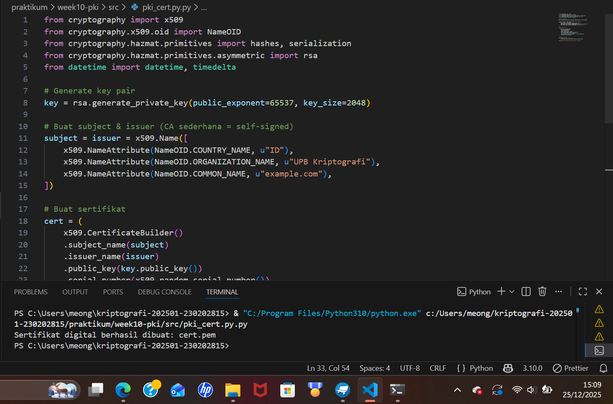
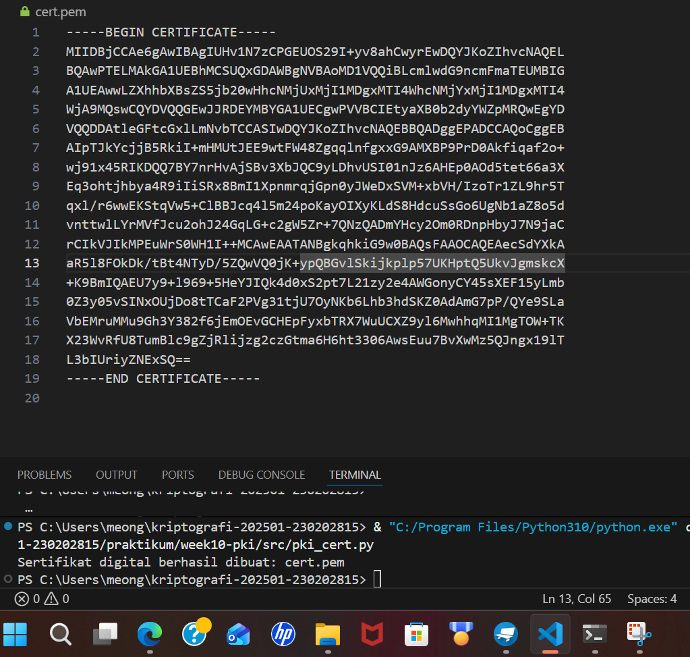

# Laporan Praktikum Minggu 10  
## Public Key Infrastructure (PKI) & Certificate Authority

**Nama:** Mohammad Nasrulloh  
**NIM:** 230202815  
**Kelas:** 5IKRA  
**Mata Kuliah:** Kriptografi  
**Topik:** Public Key Infrastructure (PKI) & Certificate Authority  

---

## 1. Pendahuluan

Public Key Infrastructure (PKI) merupakan sistem yang digunakan untuk mengelola kunci kriptografi dan sertifikat digital guna menjamin keamanan komunikasi. PKI berperan penting dalam berbagai aplikasi modern seperti HTTPS, TLS, email aman, dan transaksi online.

Salah satu komponen utama PKI adalah **Certificate Authority (CA)**, yaitu pihak tepercaya yang bertugas menerbitkan dan memverifikasi sertifikat digital. Praktikum ini bertujuan untuk memahami konsep PKI dan CA melalui pembuatan sertifikat digital sederhana menggunakan Python.

---

## 2. Tujuan Praktikum

Tujuan dari praktikum ini adalah:
1. Membuat sertifikat digital sederhana menggunakan Python.
2. Memahami peran Certificate Authority (CA) dalam sistem PKI.
3. Menganalisis fungsi PKI dalam komunikasi aman seperti HTTPS dan TLS.

---

## 3. Lingkungan dan Alat

- Sistem Operasi: Windows  
- Bahasa Pemrograman: Python 3.x  
- Library:
  - `cryptography`
- Referensi: Stallings (2017), Bab 14

---

## 4. Implementasi Pembuatan Sertifikat Digital

Pada praktikum ini dibuat sebuah **self-signed certificate**, di mana subject dan issuer adalah entitas yang sama (bertindak sebagai CA sederhana).

### Langkah-langkah:
1. Membuat pasangan kunci RSA (private key & public key).
2. Menentukan identitas sertifikat (Country, Organization, Common Name).
3. Menentukan masa berlaku sertifikat.
4. Menandatangani sertifikat menggunakan private key.
5. Menyimpan sertifikat dalam format `.pem`.

## 4.1 Source Code Pembuatan Sertifikat Digital

Berikut adalah source code Python yang digunakan untuk membuat **self-signed digital certificate** menggunakan library `cryptography`. Program ini menghasilkan pasangan kunci RSA serta sertifikat digital dalam format `.pem`.

```python
from cryptography import x509
from cryptography.x509.oid import NameOID
from cryptography.hazmat.primitives import hashes, serialization
from cryptography.hazmat.primitives.asymmetric import rsa
from datetime import datetime, timedelta

# Generate key pair
key = rsa.generate_private_key(public_exponent=65537, key_size=2048)

# Buat subject & issuer (CA sederhana = self-signed)
subject = issuer = x509.Name([
    x509.NameAttribute(NameOID.COUNTRY_NAME, u"ID"),
    x509.NameAttribute(NameOID.ORGANIZATION_NAME, u"UPB Kriptografi"),
    x509.NameAttribute(NameOID.COMMON_NAME, u"example.com"),
])

# Buat sertifikat
cert = (
    x509.CertificateBuilder()
    .subject_name(subject)
    .issuer_name(issuer)
    .public_key(key.public_key())
    .serial_number(x509.random_serial_number())
    .not_valid_before(datetime.utcnow())
    .not_valid_after(datetime.utcnow() + timedelta(days=365))
    .sign(key, hashes.SHA256())
)

# Simpan sertifikat
with open("cert.pem", "wb") as f:
    f.write(cert.public_bytes(serialization.Encoding.PEM))

print("Sertifikat digital berhasil dibuat: cert.pem")
```

### Hasil:
Program berhasil menghasilkan file sertifikat digital:

### Hasil 1 – Pembuatan Sertifikat Digital


### Hasil 2 – File Sertifikat Berhasil Dibuat


---

## 5. Verifikasi Sertifikat dan Peran CA

Sertifikat digital diverifikasi menggunakan **public key** milik issuer (CA). Dalam sistem nyata:
- Browser memiliki daftar **Root CA** tepercaya.
- Browser memverifikasi tanda tangan sertifikat menggunakan public key CA.
- Jika valid dan masa berlaku sesuai, koneksi dianggap aman.

Pada praktikum ini, sertifikat bersifat **self-signed**, sehingga hanya cocok untuk pembelajaran dan pengujian lokal.

---

## 6. Analisis PKI dalam Kasus Nyata

### a. Verifikasi Sertifikat HTTPS oleh Browser
Browser melakukan:
1. Pengecekan tanda tangan sertifikat.
2. Pengecekan rantai sertifikat hingga Root CA.
3. Validasi masa berlaku dan domain.
4. Pengecekan revocation (CRL / OCSP).

Jika semua valid, koneksi HTTPS diterima.

### b. Dampak CA Palsu
Jika CA palsu menerbitkan sertifikat:
- Penyerang dapat melakukan **Man-in-the-Middle (MITM)**.
- Data sensitif seperti password dan nomor kartu kredit dapat dicuri.
- Kepercayaan terhadap sistem keamanan internet terganggu.

### c. Pentingnya PKI
PKI menjamin:
- Kerahasiaan data (enkripsi)
- Keaslian identitas (authentication)
- Integritas data
- Kepercayaan dalam transaksi online

Tanpa PKI, komunikasi aman di internet hampir tidak mungkin dilakukan.

---

## 7. Jawaban Pertanyaan Diskusi

### 1. Apa fungsi utama Certificate Authority (CA)?
CA berfungsi sebagai pihak tepercaya yang menerbitkan, menandatangani, dan memverifikasi sertifikat digital untuk menjamin keaslian identitas pemilik sertifikat.

### 2. Mengapa self-signed certificate tidak cukup untuk sistem produksi?
Karena tidak diverifikasi oleh CA tepercaya, browser akan menandainya sebagai tidak aman sehingga rawan serangan MITM dan tidak dipercaya oleh pengguna.

### 3. Bagaimana PKI mencegah serangan MITM dalam TLS/HTTPS?
PKI memastikan server memiliki sertifikat valid yang ditandatangani CA tepercaya, sehingga penyerang tidak dapat menyamar sebagai server tanpa memiliki sertifikat yang sah.

---

## 8. Kesimpulan

Praktikum ini menunjukkan bahwa PKI dan CA memiliki peran penting dalam menjamin keamanan komunikasi digital. Melalui pembuatan sertifikat digital sederhana, mahasiswa dapat memahami konsep dasar PKI, proses penerbitan sertifikat, serta perannya dalam sistem keamanan modern seperti HTTPS dan TLS.

---

## 9. Referensi

Stallings, W. (2017). *Cryptography and Network Security: Principles and Practice*. Pearson Education.

## 10. Commit Log
```
commit week10-pki
Author: Mohammad Nasrulloh <srullasrul59@gmail.com>
Date:   2025-12-25

    week10-pki: implementasi PKI & laporan praktikum
```
