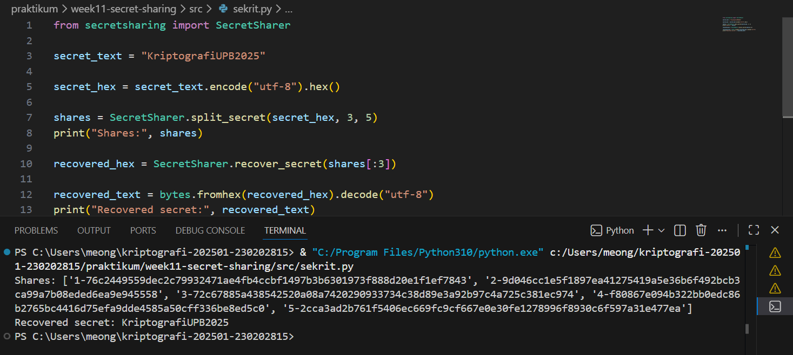
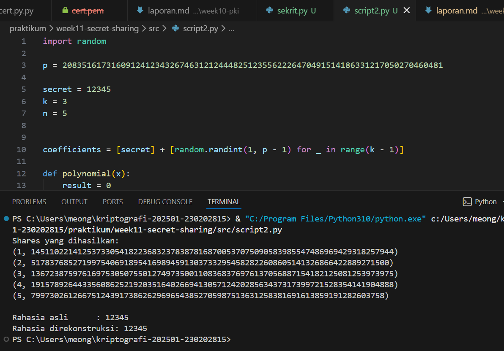

# Laporan Praktikum Minggu 11  
## Secret Sharing (Shamir’s Secret Sharing)

**Nama:** Mohammad Nasrulloh  
**NIM:** 230202815  
**Kelas:** 5IKRA  
**Mata Kuliah:** Kriptografi  
**Topik:** Shamir’s Secret Sharing (SSS)

---

## 1. Pendahuluan

Shamir’s Secret Sharing (SSS) merupakan skema kriptografi yang digunakan untuk membagi sebuah rahasia menjadi beberapa bagian (*shares*) sehingga rahasia tersebut hanya dapat direkonstruksi jika sejumlah minimum bagian (threshold) dikumpulkan. Skema ini diperkenalkan oleh Adi Shamir dan banyak digunakan dalam sistem keamanan modern seperti manajemen kunci kriptografi dan sistem pemulihan data.

Praktikum ini bertujuan untuk memahami konsep dasar Shamir Secret Sharing, melakukan simulasi pembagian dan rekonstruksi rahasia, serta menganalisis aspek keamanannya.

---

## 2. Tujuan Praktikum

Tujuan dari praktikum ini adalah:
1. Menjelaskan konsep Shamir Secret Sharing (SSS).
2. Melakukan simulasi pembagian rahasia ke beberapa pihak menggunakan skema SSS.
3. Menganalisis keamanan skema distribusi rahasia berbasis threshold.

---

## 3. Lingkungan dan Alat

- Sistem Operasi: Windows  
- Bahasa Pemrograman: Python 3.x  
- Library:
  - `secretsharing`
- Referensi:
  - Stinson, D. R. (2019). *Cryptography: Theory and Practice*, Bab 6.

---

## 4. Implementasi Shamir Secret Sharing

Pada praktikum ini digunakan library `secretsharing` untuk melakukan pembagian dan rekonstruksi rahasia secara sederhana.

### Langkah-langkah:
1. Menentukan rahasia yang akan dibagi.
2. Menentukan jumlah total share (*n*).
3. Menentukan threshold (*k*), yaitu jumlah minimum share yang dibutuhkan untuk merekonstruksi rahasia.
4. Membagi rahasia menjadi beberapa share.
5. Mereonstruksi rahasia menggunakan minimal *k* share.

### Hasil:
- Rahasia berhasil dibagi menjadi beberapa share.
- Rahasia berhasil direkonstruksi kembali menggunakan minimal threshold share.
- Rekonstruksi gagal jika jumlah share kurang dari threshold.

### Source Code Implementasi (Menggunakan Library)
```python
from secretsharing import SecretSharer

secret_text = "KriptografiUPB2025"

secret_hex = secret_text.encode("utf-8").hex()

# Membagi rahasia menjadi 5 share dengan threshold 3
shares = SecretSharer.split_secret(secret_hex, 3, 5)
print("Shares:", shares)

recovered_hex = SecretSharer.recover_secret(shares[:3])

recovered_text = bytes.fromhex(recovered_hex).decode("utf-8")
print("Recovered secret:", recovered_text)
```


---

## 5. Simulasi Manual (Tanpa Library)

Pada langkah ini dilakukan simulasi **Shamir Secret Sharing secara manual** tanpa menggunakan library eksternal. Tujuan dari simulasi ini adalah untuk memahami dasar matematis dari skema Shamir Secret Sharing yang berbasis pada polinomial dan interpolasi Lagrange.

#### a. Pemilihan Bilangan Prima
Dipilih sebuah bilangan prima \( p \) yang cukup besar untuk digunakan sebagai modulo dalam seluruh operasi aritmetika. Penggunaan modulo bilangan prima bertujuan untuk menjaga sifat keamanan dan menghindari collision pada perhitungan.

#### b. Pembentukan Polinomial
Dibentuk sebuah polinomial berderajat \( k-1 \) sebagai berikut:

\[
f(x) = a_0 + a_1x + a_2x^2 + \dots + a_{k-1}x^{k-1} \mod p
\]

dengan:
- \( a_0 \) sebagai **rahasia (secret)**,
- \( a_1, a_2, \dots \) sebagai koefisien acak.

#### c. Pembagian Share
Nilai share diperoleh dengan menghitung pasangan titik:

\[
(x, f(x))
\]

Setiap pasangan titik tersebut dibagikan kepada pihak yang berbeda sebagai **share rahasia**.

#### d. Rekonstruksi Rahasia
Rekonstruksi rahasia dilakukan menggunakan **Interpolasi Lagrange** dengan minimal \( k \) buah share. Nilai rahasia diperoleh dengan menghitung nilai polinomial pada \( x = 0 \), yaitu:

\[
secret = f(0)
\]

Jika jumlah share yang tersedia kurang dari threshold \( k \), maka rahasia tidak dapat direkonstruksi.

#### e. Hasil Simulasi Manual

Berikut adalah hasil simulasi manual pembagian dan rekonstruksi rahasia menggunakan pendekatan polinomial dan interpolasi Lagrange:



---

## 6. Analisis Keamanan Shamir Secret Sharing

### a. Keamanan Skema (k, n)
Skema (k, n) tetap aman meskipun sebagian share bocor karena informasi dari kurang dari *k* share tidak memberikan informasi apa pun tentang rahasia asli.

### b. Risiko Pemilihan Threshold
- **Threshold terlalu kecil**: meningkatkan risiko rekonstruksi rahasia oleh pihak tidak berwenang.
- **Threshold terlalu besar**: meningkatkan risiko rahasia tidak dapat direkonstruksi jika beberapa share hilang.

### c. Penerapan di Dunia Nyata
Shamir Secret Sharing banyak digunakan dalam:
- Manajemen kunci cryptocurrency (multi-signature wallet).
- Sistem recovery password.
- Penyimpanan kunci enkripsi tingkat enterprise.
- Sistem keamanan organisasi dengan pembagian otoritas.

---

## 7. Jawaban Pertanyaan Diskusi

### 1. Apa keuntungan utama Shamir Secret Sharing dibanding membagikan salinan kunci secara langsung?
SSS meningkatkan keamanan karena tidak ada satu pihak pun yang memiliki seluruh rahasia, sehingga mengurangi risiko kebocoran total.

### 2. Apa peran threshold (k) dalam keamanan secret sharing?
Threshold menentukan jumlah minimum share yang dibutuhkan untuk merekonstruksi rahasia, sehingga menjadi parameter utama dalam keseimbangan antara keamanan dan ketersediaan.

### 3. Contoh skenario nyata penggunaan SSS
Pengamanan private key cryptocurrency di mana kunci dibagi ke beberapa pemilik, dan hanya kombinasi tertentu yang dapat melakukan transaksi.

---

## 8. Kesimpulan

Praktikum ini menunjukkan bahwa Shamir Secret Sharing merupakan metode yang efektif dan aman untuk distribusi rahasia. Dengan konsep threshold, skema ini mampu melindungi rahasia meskipun sebagian share bocor, serta memberikan fleksibilitas dalam pengelolaan keamanan sistem kriptografi modern.

---

## 9. Referensi

Stinson, D. R. (2019). *Cryptography: Theory and Practice*. CRC Press.

---

## 10. Commit Log

```
commit week11-secret-sharing
Author: Mohammad Nasrulloh <srullasrul59@gmail.com>
Date:   2025-12-25

    week11-secret-sharing: implementasi dan laporan Shamir Secret Sharing
```


