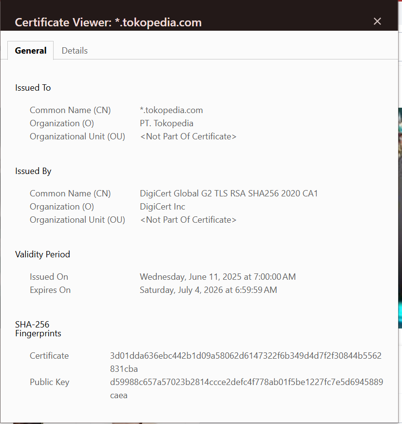
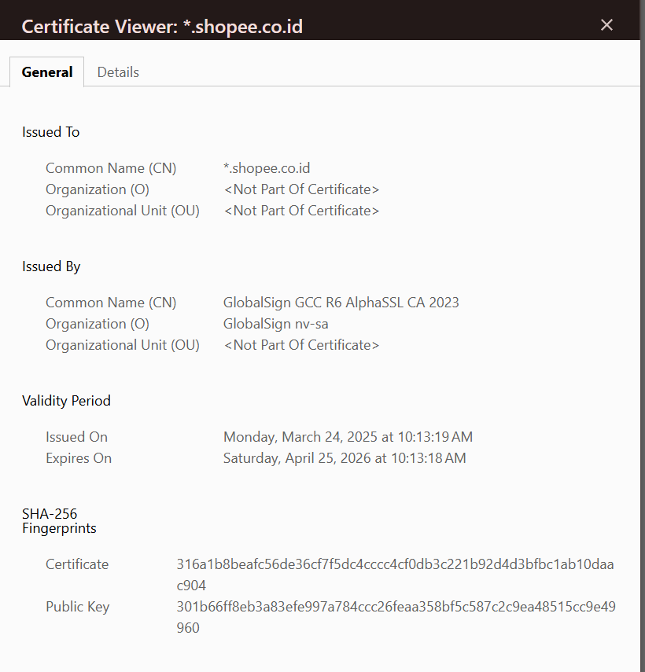

# Praktikum Week 12 — Aplikasi TLS & E‑Commerce

**Nama:** Mohammad Nasrulloh  
**NIM:** 230202815  
**Kelas:** 5IKRA  
**Mata Kuliah:** Kriptografi  
**Topik:** Aplikasi TLS & E‑Commerce

---

## Pendahuluan

Transport Layer Security (TLS) merupakan protokol kriptografi yang digunakan untuk mengamankan komunikasi data di jaringan, terutama pada email dan web (HTTPS). Dalam praktik e‑commerce, TLS berperan penting untuk melindungi data sensitif seperti kredensial login, informasi pribadi, dan data pembayaran. Praktikum ini bertujuan untuk menganalisis penerapan SSL/TLS pada email dan e‑commerce serta mengevaluasi isu etika dan privasi yang muncul.

---

## Studi Kasus Penerapan SSL/TLS

### 1. Analisis SSL/TLS pada Website E‑Commerce

Observasi dilakukan menggunakan browser (Chrome) dengan memeriksa sertifikat digital pada dua website e‑commerce populer di Indonesia.

#### a. Tokopedia ([https://www.tokopedia.com](https://www.tokopedia.com))

* **Issuer (CA)**: DigiCert Inc
* **Masa Berlaku**: ± 1 tahun
* **Algoritma Kriptografi**:

  * Public Key: RSA / ECDSA
  * Enkripsi Simetris: AES‑128 / AES‑256
  * Hash: SHA‑256
* **Status Keamanan**: HTTPS aktif, koneksi terenkripsi dan tervalidasi

#### b. Shopee ([https://shopee.co.id](https://shopee.co.id))

* **Issuer (CA)**: DigiCert Inc
* **Masa Berlaku**: ± 1 tahun
* **Algoritma Kriptografi**:

  * Public Key: RSA / ECDSA
  * Enkripsi Simetris: AES‑128 / AES‑256
  * Hash: SHA‑256
* **Status Keamanan**: HTTPS aktif, koneksi aman

#### Perbandingan HTTPS vs HTTP

| Aspek                | HTTP           | HTTPS       |
| -------------------- | -------------- | ----------- |
| Enkripsi             | Tidak ada      | Ada (TLS)   |
| Keamanan Data        | Rentan disadap | Terlindungi |
| Sertifikat Digital   | Tidak ada      | Ada (CA)    |
| Kepercayaan Pengguna | Rendah         | Tinggi      |

Website tanpa HTTPS sangat rentan terhadap penyadapan dan manipulasi data.

---

### 2. Enkripsi dalam Transaksi E‑Commerce

Pada proses login dan pembayaran di e‑commerce:

* Data username, password, dan OTP dienkripsi menggunakan TLS.
* Informasi pembayaran (nomor kartu, token pembayaran) diamankan dengan enkripsi simetris (AES).
* TLS mencegah serangan **Man‑in‑the‑Middle (MITM)** dengan verifikasi sertifikat.

**Ancaman jika TLS tidak digunakan**:

* Pencurian akun
* Penyadapan data kartu kredit
* Manipulasi transaksi
* Phishing dan spoofing

---

## Analisis Etika & Privasi

### 1. Isu Privasi pada Email Terenkripsi

Teknologi seperti **PGP** dan **S/MIME** memungkinkan email dienkripsi end‑to‑end sehingga hanya pengirim dan penerima yang dapat membaca isi pesan. Hal ini melindungi privasi, tetapi juga menimbulkan tantangan bagi organisasi dan pemerintah.

### 2. Dilema Etika

* **Audit Email Karyawan**
  Perusahaan memiliki kepentingan keamanan, namun membuka email terenkripsi karyawan tanpa izin melanggar privasi.

* **Pengawasan Pemerintah**
  Enkripsi melindungi warga, tetapi menyulitkan penegakan hukum dalam kasus kejahatan siber. Hal ini memunculkan dilema antara keamanan nasional dan hak privasi individu.

---

## Jawaban Pertanyaan Diskusi

### 1. Perbedaan Utama HTTP dan HTTPS

HTTP tidak menggunakan enkripsi sehingga data dikirim dalam bentuk plaintext. HTTPS menggunakan TLS untuk mengenkripsi data, menjamin kerahasiaan, integritas, dan autentikasi.

### 2. Pentingnya Sertifikat Digital dalam TLS

Sertifikat digital memastikan identitas server yang sah dan mencegah pemalsuan website. Sertifikat dikeluarkan oleh Certificate Authority (CA) yang dipercaya.

### 3. Kriptografi, Privasi, dan Tantangan Etika

Kriptografi melindungi privasi komunikasi digital, namun menimbulkan tantangan hukum dan etika terkait pengawasan, penegakan hukum, dan tanggung jawab organisasi.

---

## Kesimpulan

TLS/SSL merupakan komponen vital dalam keamanan email dan e‑commerce. Penerapannya meningkatkan kepercayaan pengguna dan melindungi data sensitif. Namun, penggunaan kriptografi juga harus diimbangi dengan kebijakan etika dan hukum yang adil agar privasi tetap terjaga.

---

## Referensi

* Stallings, W. (2017). *Cryptography and Network Security*, Bab 15.
