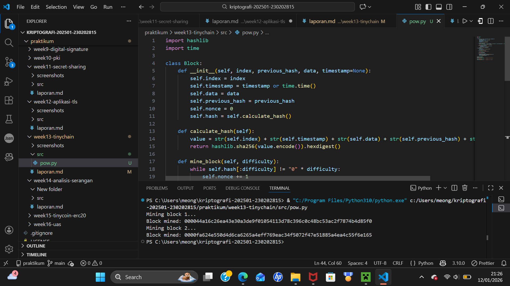

# Praktikum Week 13 – TinyChain Proof of Work

**Nama:** Mohammad Nasrulloh  
**NIM:** 230202815  
**Mata Kuliah:** Kriptografi  
**Topik:** TinyChain – Proof of Work (PoW)

---

## 1. Pendahuluan

Blockchain merupakan teknologi penyimpanan data terdistribusi yang menggunakan kriptografi
untuk menjamin keamanan, integritas, dan keabsahan data. Salah satu mekanisme utama dalam
blockchain adalah **Proof of Work (PoW)**, yang memanfaatkan fungsi hash kriptografis.

Pada praktikum ini dilakukan simulasi blockchain sederhana menggunakan Python
untuk memahami peran hash function dan PoW.

---

## 2. Hash Function dalam Blockchain

Fungsi hash kriptografis memiliki karakteristik utama:
- Deterministik
- Sulit dibalik (one-way)
- Perubahan kecil pada input menghasilkan output yang sangat berbeda
- Output berukuran tetap

Dalam blockchain, hash digunakan untuk:
- Menghubungkan blok satu dengan yang lain
- Menjamin integritas data
- Mendeteksi perubahan atau pemalsuan data

---

## 3. Proof of Work (PoW)

Proof of Work adalah mekanisme konsensus yang mengharuskan penambang (miner)
menyelesaikan teka-teki kriptografi dengan mencari nilai **nonce** yang menghasilkan hash
sesuai tingkat kesulitan (difficulty).

Semakin tinggi difficulty, semakin lama waktu yang dibutuhkan untuk menemukan hash yang valid.

---

## 4. Hasil Simulasi Mining

Program TinyChain berhasil melakukan mining beberapa blok dengan:
- Hash SHA-256
- Difficulty = 4
- Proses mining menghasilkan hash dengan prefix "0000"



---

## 5. Analisis Keamanan Blockchain dan PoW

### a. Mengapa fungsi hash sangat penting dalam blockchain?
Karena hash mengikat isi blok dengan blok sebelumnya. Perubahan sekecil apa pun
akan mengubah hash dan merusak seluruh rantai blok setelahnya.

### b. Bagaimana Proof of Work mencegah double spending?
Untuk memalsukan transaksi, penyerang harus menambang ulang blok tersebut dan
seluruh blok setelahnya dengan difficulty yang sama, yang membutuhkan sumber daya
komputasi sangat besar sehingga tidak praktis.

### c. Kelemahan Proof of Work dalam efisiensi energi
PoW membutuhkan daya komputasi tinggi dan konsumsi energi besar.
Hal ini membuat PoW tidak ramah lingkungan dan kurang efisien dibandingkan
mekanisme konsensus lain seperti Proof of Stake (PoS).

---

## 6. Kesimpulan

Dari praktikum ini dapat disimpulkan bahwa:
- Hash function adalah fondasi keamanan blockchain
- Proof of Work memberikan keamanan melalui kesulitan komputasi
- PoW efektif tetapi memiliki kelemahan dalam konsumsi energi

Simulasi TinyChain membantu memahami konsep dasar blockchain secara praktis.

---

## Referensi
- Stallings, W. (2017). *Cryptography and Network Security*, Bab 16  
- Stinson, D. (2019). *Cryptography: Theory and Practice*, Bab 8

## Commit Log

```
commit week13-tinychain
Author: Mohammad Nasrulloh <srullasrul59@gmail.com>
Date:   2026-01-12

    week13-tinychain: TinyChain Proof of Work
```
