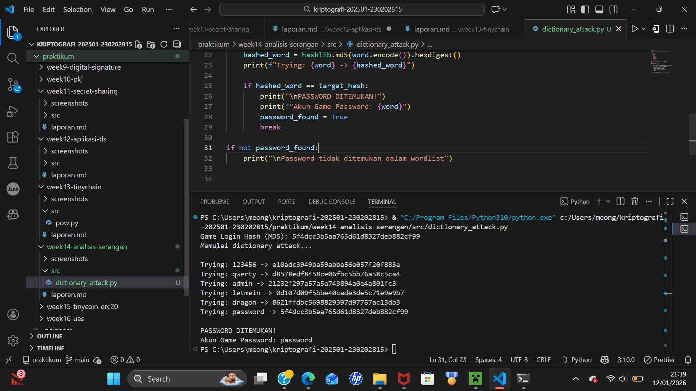

# Praktikum Week 14 – Analisis Serangan Kriptografi

**Nama:** Mohammad Nasrulloh  
**NIM:** 230202815  
**Mata Kuliah:** Kriptografi  
**Topik:** Analisis Serangan Kriptografi pada Sistem Game Online

---

## 1. Pendahuluan

Game online merupakan sistem terdistribusi yang memanfaatkan jaringan
dan kriptografi untuk menjaga keamanan data pemain, seperti password,
item, dan mata uang dalam game. Keamanan sistem login menjadi aspek
krusial karena berkaitan langsung dengan perlindungan akun pemain.

Namun, masih banyak sistem game—terutama game lama atau private server—
yang menggunakan algoritma kriptografi lemah atau implementasi yang tidak
aman. Kondisi ini membuka peluang terjadinya serangan kriptografi.

Pada praktikum ini dilakukan analisis studi kasus serangan kriptografi
pada sistem login game online untuk memahami kelemahan dan solusi
keamanan yang tepat.

---

## 2. Identifikasi Kasus Serangan

### Kasus yang Dianalisis
Kasus yang dianalisis adalah **dictionary attack terhadap sistem login game online**
yang menggunakan **hash MD5 tanpa salt** untuk menyimpan password pemain.

### Vektor Serangan
- Hash password MD5 hasil kebocoran database
- Wordlist password umum pemain game
- Tidak adanya pembatasan percobaan login

Serangan ini memungkinkan penyerang menebak password pemain
dan mengambil alih akun game (account takeover).

---

## 3. Evaluasi Kelemahan Sistem

### a. Kelemahan Algoritma Kriptografi
MD5 memiliki kelemahan serius, antara lain:
- Hash terlalu cepat sehingga mudah di-brute force
- Tidak dirancang untuk penyimpanan password
- Rentan terhadap dictionary attack dan rainbow table

### b. Kelemahan Implementasi
Selain algoritma yang lemah, sistem juga memiliki kelemahan implementasi:
- Tidak menggunakan salt
- Tidak ada rate limiting login
- Tidak ada mekanisme penguncian akun

Kombinasi kelemahan ini memperbesar dampak serangan.

---

## 4. Hasil Simulasi Serangan

Simulasi serangan dilakukan menggunakan script Python
yang melakukan dictionary attack terhadap hash MD5 password akun game.

Hasil simulasi menunjukkan bahwa password dapat ditemukan
dalam waktu sangat singkat menggunakan wordlist sederhana.



Hal ini membuktikan bahwa penggunaan MD5
tidak aman untuk sistem login game online.

---

## 5. Analisis Keamanan dan Rekomendasi

### a. Mengapa sistem ini rentan?
Karena MD5 adalah hash cepat tanpa salt,
sehingga tidak mampu menahan serangan brute force modern.

### b. Rekomendasi Algoritma Pengganti
Untuk meningkatkan keamanan, direkomendasikan:
- Mengganti **MD5 → Argon2**
- Alternatif: bcrypt atau scrypt

Algoritma ini dirancang khusus untuk penyimpanan password
dan tahan terhadap brute force serta GPU attack.

### c. Rekomendasi Tambahan
- Gunakan salt unik per user
- Terapkan rate limiting login
- Gunakan TLS 1.3 untuk komunikasi client–server
- Tambahkan autentikasi dua faktor (2FA)

---

## 6. Jawaban Pertanyaan Diskusi

### 1. Mengapa banyak sistem lama masih rentan terhadap brute force?
Karena menggunakan algoritma kriptografi usang
dan tidak diperbarui mengikuti perkembangan ancaman.

### 2. Apa perbedaan kelemahan algoritma dan implementasi?
Kelemahan algoritma berasal dari desain kriptografi,
sedangkan kelemahan implementasi berasal dari cara penerapannya.

### 3. Bagaimana menjaga keamanan kriptografi di masa depan?
Dengan audit keamanan berkala, pembaruan algoritma,
dan penerapan standar keamanan modern.

---

## 7. Kesimpulan

Dari praktikum ini dapat disimpulkan bahwa:
- Sistem login game online sangat bergantung pada kriptografi
- Penggunaan hash MD5 sangat tidak aman
- Algoritma modern seperti Argon2 memberikan perlindungan jauh lebih kuat

Analisis ini menunjukkan pentingnya pemilihan algoritma kriptografi
yang tepat untuk menjaga keamanan sistem game online.

---

## Referensi
- Stallings, W. (2017). *Cryptography and Network Security*, Bab 16  
- OWASP. Password Storage Cheat Sheet  
- NIST Digital Identity Guidelines

---

## Commit Log

```
commit week14-analisis-serangan
Author: Mohammad Nasrulloh <srullasrul59@gmail.com>
Date:   2026-01-12

    week14-analisis-serangan: Analisis Serangan
```