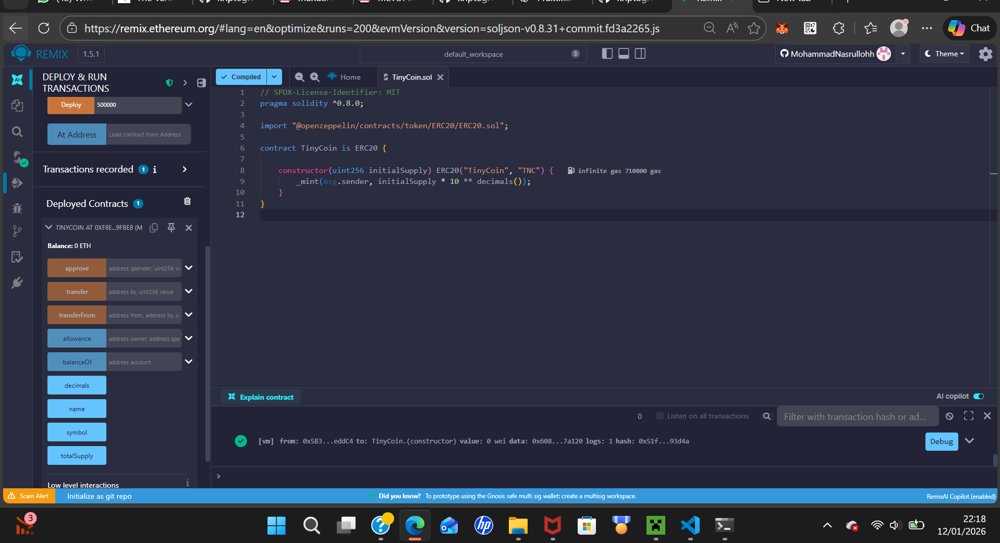
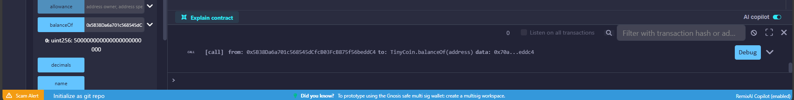
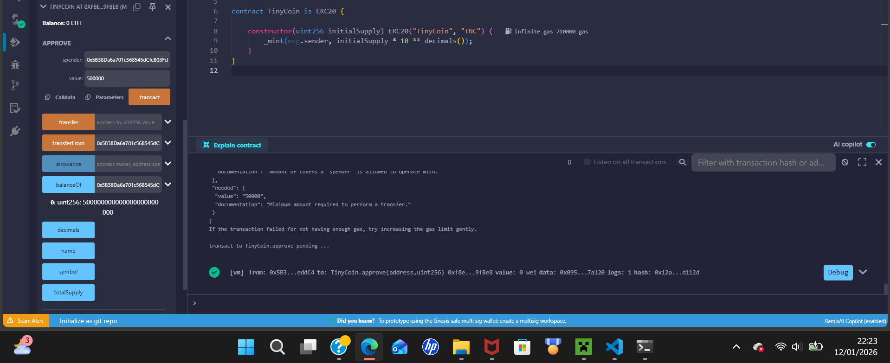
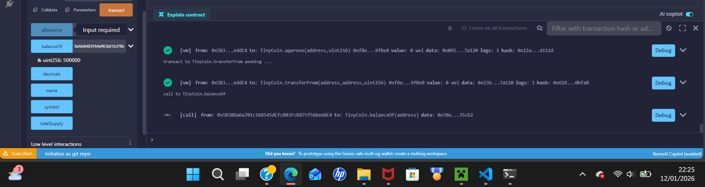

# 📘 Week 15 – Proyek Kelompok TinyCoin ERC20

**Mata Kuliah:** Kriptografi  
**Nama:** Mohammad Nasrulloh  
**NIM:** 230202815  

---

## 📌 Deskripsi Proyek

TinyCoin adalah implementasi **smart contract ERC20**
menggunakan bahasa **Solidity** dan library **OpenZeppelin**.
Proyek ini dibuat untuk memahami konsep token kriptografi,
mekanisme transfer token, serta analisis keamanan dasar
pada blockchain Ethereum.

---

## 🎯 Tujuan Pembelajaran

Setelah menyelesaikan proyek ini, mahasiswa mampu:
1. Mengembangkan smart contract ERC20
2. Melakukan deployment kontrak ke EVM
3. Menguji fungsi utama token
4. Mendokumentasikan proyek menggunakan Git
5. Melakukan analisis keamanan dasar smart contract

---

## ⚙️ Teknologi yang Digunakan

- Solidity ^0.8.x  
- OpenZeppelin ERC20  
- Remix IDE  
- Ethereum Virtual Machine (EVM)

---

## 📜 Gambaran Smart Contract TinyCoin

TinyCoin merupakan token standar **ERC20** dengan karakteristik:
- Token Name: **TinyCoin**
- Symbol: **TNC**
- Desimal: **18**
- Initial supply dicetak ke alamat deployer saat kontrak dibuat
- Menggunakan OpenZeppelin untuk keamanan dan standarisasi

---

## 🚀 Proses Deployment

Smart contract dikompilasi dan dideploy menggunakan **Remix IDE**
pada lingkungan **JavaScript VM / testnet Ethereum**.
Setelah proses deployment berhasil, kontrak siap diuji
menggunakan fungsi-fungsi ERC20 yang tersedia.

---

## 🧪 Hasil Pengujian







---

## 🔐 Analisis Keamanan Dasar

Beberapa aspek keamanan yang dianalisis:
- **Overflow dan Underflow**  
  Tidak terjadi karena Solidity versi ≥ 0.8 memiliki proteksi otomatis.
- **Reentrancy Attack**  
  Kontrak tidak memiliki fungsi kompleks yang memicu reentrancy.
- **Unauthorized Minting**  
  Token hanya dicetak satu kali pada constructor.

Secara keseluruhan, smart contract tergolong aman
untuk skala pembelajaran.

---

## 📝 Dokumentasi Teknis

Dokumentasi teknis lengkap meliputi:
- Penjelasan kontrak ERC20 TinyCoin
- Hasil pengujian fungsi utama
- Jawaban pertanyaan diskusi
- Analisis keamanan dasar


---

## 📚 Referensi

- Stallings, W. (2017). *Cryptography and Network Security*  
- Stinson, D. (2019). *Cryptography: Theory and Practice*  
- OpenZeppelin Documentation  

---

## ✅ Kesimpulan

Implementasi TinyCoin ERC20 berhasil dilakukan dengan baik.
Smart contract dapat dideploy, diuji, dan berfungsi sesuai standar ERC20.
Dokumentasi dan bukti pengujian telah dilampirkan secara lengkap.

---

## Commit Log

```
commit week15-tinycoin-erc20
Author: Mohammad Nasrulloh <srullasrul59@gmail.com>
Date:   2026-01-12

    week15-tinycoin-erc20: Proyek Kelompok TinyCoin ERC20
```