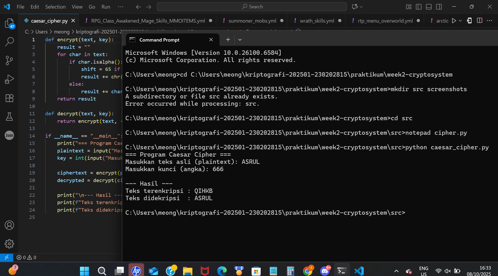

# Laporan Praktikum Kriptografi 📜

## **Minggu ke-:** 2 **Topik:** Caesar Cipher / Cryptosystem

**Nama:** Mohammad Nasrulloh
**NIM:** 230202815
**Kelas:** 2IKRA

-----

## 1\. Tujuan

  - Memahami prinsip dasar **enkripsi** dan **dekripsi** menggunakan algoritma **Caesar Cipher**.
  - Mengimplementasikan Caesar Cipher menggunakan bahasa pemrograman **Python**.
  - Mengamati hasil enkripsi dan dekripsi dari teks input yang diberikan.

-----

## 2\. Dasar Teori

Kriptografi adalah ilmu yang mempelajari teknik untuk menjaga kerahasiaan pesan agar hanya pihak yang berwenang dapat membacanya. Salah satu bentuk kriptografi klasik adalah **cipher substitusi**, di mana setiap huruf dalam teks diganti dengan huruf lain berdasarkan aturan tertentu.

Algoritma **Caesar Cipher** adalah cipher substitusi sederhana yang menggeser setiap huruf dalam *plaintext* sejauh *$k$* posisi pada alfabet. Operasi ini menggunakan konsep **modular aritmetika**, sehingga huruf tetap berada dalam rentang A–Z atau a–z. Misalnya, jika **kunci** (*key*) = 3, huruf A akan menjadi D, B menjadi E, dan seterusnya.

-----

## 3\. Alat dan Bahan

Alat dan bahan yang digunakan dalam praktikum ini meliputi:

1.  **Perangkat Lunak:**
      * Python 3.x
      * Visual Studio Code / editor teks lainnya
      * Git dan akun GitHub
      * Library Python standar (tidak memerlukan *library* tambahan seperti *pycryptodome* untuk Caesar Cipher dasar).
2.  **Struktur Proyek:**
      * Folder proyek: `week2-cryptosystem/`
          * `src/caesar_cipher.py`

-----

## 4\. Langkah Percobaan

Langkah-langkah yang dilakukan dalam praktikum adalah sebagai berikut:

1.  Masuk ke direktori proyek `week2-cryptosystem`.

2.  Membuat *file* implementasi Python bernama `caesar_cipher.py` di dalam *folder* `src/`.

3.  Menyalin atau menulis kode implementasi Caesar Cipher ke dalam *file* tersebut.

4.  Menjalankan program melalui *Command Prompt* (CMD) atau *terminal* dengan perintah:

    ```bash
    python src\caesar_cipher.py
    ```

-----

## 5\. Hasil dan Pembahasan

### 5.1. Hasil Eksekusi Program

Berikut adalah contoh hasil eksekusi program Caesar Cipher dengan teks input dan kunci tertentu:
| Proses | Teks Input | Kunci | Teks Output |
| :---: | :---: | :---: | :---: |
| Enkripsi | `HELLO` | 3 | `KHOOR` |
| Dekripsi | `KHOOR` | 3 | `HELLO` |
| Enkripsi | `praktikum` | 5 | `uwfpynpzr` |
| Dekripsi | `uwfpynpzr` | 5 | `praktikum` |



### 5.2. Pembahasan

Program berhasil mengenkripsi teks input (*plaintext*) menjadi *ciphertext* dan mendekripsinya kembali menjadi *plaintext* awal, sesuai dengan kunci geser yang diberikan.

  * Fungsi **`encrypt()`** berhasil menerapkan prinsip pergeseran huruf Caesar Cipher dan konsep **modular aritmetika** untuk memastikan huruf yang digeser tetap berada dalam batas alfabet (A–Z atau a–z).
  * Fungsi **`decrypt()`** berhasil melakukan operasi invers (kebalikan) dari enkripsi, yang membuktikan algoritma **Caesar Cipher** diimplementasikan dengan benar.
  * Contoh **`HELLO`** dengan kunci **3** menghasilkan **`KHOOR`**, dan berhasil didekripsi kembali menjadi **`HELLO`**, menunjukkan fungsi *encrypt* dan *decrypt* bekerja sesuai ekspektasi tanpa *error*.

-----

## 6\. Jawaban Pertanyaan

### Pertanyaan 1: Apa perbedaan Caesar Cipher dan Vigenère Cipher?

**Jawaban:**
Perbedaan utama terletak pada penggunaan kuncinya:

  * **Caesar Cipher** menggunakan **satu kunci numerik tetap** (*shift*) untuk seluruh pesan, menjadikannya *monoalfabetik*.
  * **Vigenère Cipher** menggunakan **kata kunci** (*keyphrase*). Setiap huruf dari kata kunci tersebut menghasilkan pergeseran yang berbeda untuk setiap huruf *plaintext*, menjadikannya **polialfabetik** (lebih kuat).

### Pertanyaan 2: Apa kelemahan utama Caesar Cipher?

**Jawaban:**
Kelemahan utamanya adalah **mudah dipecahkan** (ditembus). Karena hanya memiliki $25$ kemungkinan kunci pergeseran yang valid ($1$ sampai $25$), penyerang dapat dengan mudah menggunakan metode ***brute force*** (mencoba semua kemungkinan kunci) untuk mendekripsi pesan dalam waktu yang sangat singkat.

-----

## 7\. Kesimpulan

Percobaan ini membuktikan bahwa algoritma **Caesar Cipher** dapat diimplementasikan dan digunakan untuk mengenkripsi serta mendekripsi teks dengan benar menggunakan Python. Implementasi ini berhasil menunjukkan aplikasi praktis dari prinsip **cipher substitusi** sederhana dan konsep **modular aritmetika** dalam kriptografi klasik. Program bekerja sesuai ekspektasi dan dapat menjadi dasar untuk mempelajari algoritma kriptografi yang lebih kompleks.

-----

## 8\. Daftar Pustaka

1.  Katz, J., & Lindell, Y. *(Tahun Publikasi)*. **Introduction to Modern Cryptography**.
2.  Stallings, W. *(Tahun Publikasi)*. **Cryptography and Network Security**.
3.  Modul Praktikum Kriptografi – Politeknik Negeri Semarang (2025).
