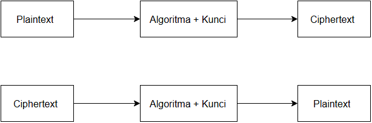

# Laporan Praktikum Week 2 — Cryptosystem

## Identitas
**Nama:** Mohammad Nasrulloh  
**NIM:** 230202815  
**Kelas:** 5IKRB  
**Mata Kuliah:** Kriptografi  
**Topik:** Cryptosystem (Komponen, Enkripsi & Dekripsi, Simetris & Asimetris)

---

## Tujuan Pembelajaran
Setelah mengikuti praktikum ini, mahasiswa diharapkan mampu:
1. Mengidentifikasi komponen dasar kriptosistem (plaintext, ciphertext, kunci, algoritma).  
2. Menggambarkan proses enkripsi dan dekripsi sederhana.  
3. Mengklasifikasikan jenis kriptosistem (simetris dan asimetris).  

---

## 1. Komponen Dasar Kriptosistem
Sebuah **kriptosistem** terdiri dari beberapa komponen utama sebagai berikut:

| Komponen | Deskripsi |
|-----------|------------|
| **Plaintext** | Pesan asli yang ingin dikirim atau disimpan sebelum dienkripsi. |
| **Ciphertext** | Pesan hasil enkripsi yang tidak dapat dibaca tanpa kunci. |
| **Kunci (Key)** | Nilai rahasia yang digunakan dalam proses enkripsi dan dekripsi. |
| **Algoritma** | Metode matematis untuk mengubah plaintext menjadi ciphertext dan sebaliknya. |

---

## 2. Skema Dasar Kriptosistem

Proses enkripsi dan dekripsi dapat dijelaskan melalui diagram berikut:



Keterangan:
- **Enkripsi:** Plaintext diubah menjadi Ciphertext menggunakan algoritma dan kunci.  
- **Dekripsi:** Ciphertext diubah kembali menjadi Plaintext menggunakan algoritma dan kunci yang sama (atau berbeda tergantung jenis sistemnya).

---

## 3. Implementasi Program Enkripsi dan Dekripsi

Program berikut merupakan simulasi **Caesar Cipher**, yaitu algoritma substitusi sederhana dengan pergeseran huruf sebanyak nilai kunci tertentu.

### File: `src/simple_crypto.py`
```python
def encrypt(plaintext, key):
    result = ""
    for char in plaintext:
        if char.isalpha():
            shift = 65 if char.isupper() else 97
            result += chr((ord(char) - shift + key) % 26 + shift)
        else:
            result += char
    return result

def decrypt(ciphertext, key):
    result = ""
    for char in ciphertext:
        if char.isalpha():
            shift = 65 if char.isupper() else 97
            result += chr((ord(char) - shift - key) % 26 + shift)
        else:
            result += char
    return result

if __name__ == "__main__":
    message = "Cryptosystem Test"
    key = 5

    enc = encrypt(message, key)
    dec = decrypt(enc, key)

    print("Plaintext :", message)
    print("Ciphertext:", enc)
    print("Decrypted :", dec)
```
##  4. Hasil Eksekusi


## 5. Klasifikasi Kriptosistem

| Jenis     | Deskripsi                                                                                                              | Contoh Algoritma |
|------------|------------------------------------------------------------------------------------------------------------------------|------------------|
| **Simetris**   | Menggunakan kunci yang sama untuk proses enkripsi dan dekripsi. Lebih cepat dan efisien, tetapi distribusi kunci menjadi tantangan utama. | AES, DES |
| **Asimetris**  | Menggunakan dua kunci berbeda: kunci publik untuk enkripsi dan kunci privat untuk dekripsi. Lebih aman untuk komunikasi terbuka. | RSA, ECC |

---

### Penjelasan Tambahan

**Kriptografi Simetris:**  
Efisien untuk data besar, digunakan dalam penyimpanan atau komunikasi tertutup (misalnya antar server).

**Kriptografi Asimetris:**  
Digunakan dalam pengiriman kunci atau komunikasi aman di internet (misalnya HTTPS).

---

# 5. Pertanyaan Diskusi

**Sebutkan komponen utama dalam sebuah kriptosistem.**  
**Jawab:** Plaintext, Ciphertext, Kunci, dan Algoritma.

---

**Apa kelebihan dan kelemahan sistem simetris dibandingkan asimetris?**

- **Kelebihan:** Proses enkripsi dan dekripsi lebih cepat serta efisien untuk data besar.  
- **Kelemahan:** Distribusi kunci menjadi masalah karena harus dibagikan secara aman kepada pihak lain.

---

**Mengapa distribusi kunci menjadi masalah utama dalam kriptografi simetris?**  
**Jawab:** Karena jika kunci diketahui oleh pihak yang tidak berwenang, maka pesan terenkripsi dapat dengan mudah dibuka. Oleh karena itu, distribusi kunci perlu dilakukan melalui saluran yang aman atau menggunakan sistem asimetris.

---


