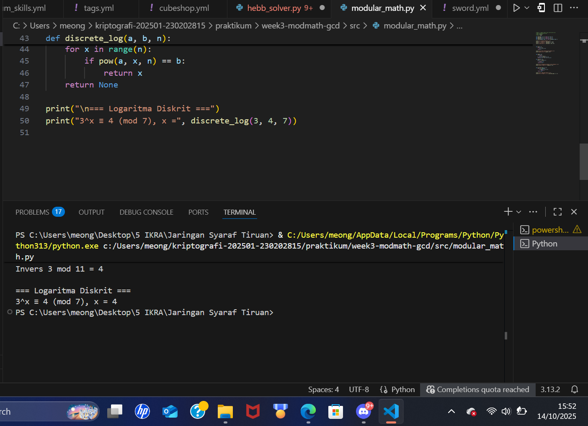

# Week 3 - Modular Math, GCD, dan Logaritma Diskrit

**Nama:** Mohammad Nasrulloh  
**NIM:** 230202815  
**Kelas:** 2IKRA  

---

## 1. Teori Singkat

### 🔹 Aritmetika Modular
Aritmetika modular adalah sistem operasi matematika dengan hasil sisa pembagian.  
Contoh:  
`7 + 5 (mod 12) = 0` karena 12 membagi habis 12.

Operasi modular umum digunakan dalam **kriptografi**, misalnya pada RSA untuk operasi pangkat dan invers modular.

### 🔹 GCD & Algoritma Euclidean
**GCD (Greatest Common Divisor)** adalah bilangan terbesar yang dapat membagi dua bilangan tanpa sisa.  
Algoritma Euclidean menghitungnya dengan iterasi pembagian berulang hingga sisa nol.

### 🔹 Extended Euclidean & Invers Modular
Digunakan untuk mencari invers `a⁻¹` dalam modulus `n`, di mana `(a * a⁻¹) mod n = 1`.  
Invers modular penting untuk **dekripsi kunci publik RSA**.

### 🔹 Logaritma Diskrit
Masalah logaritma diskrit mencari `x` sehingga `a^x ≡ b (mod n)`.  
Masalah ini sulit untuk modulus besar dan menjadi dasar keamanan algoritma seperti **Diffie-Hellman** dan **ElGamal**.

---

## 2. Hasil Pengujian

| Operasi | Input | Hasil |
|----------|--------|--------|
| mod_add  | 7 + 5 mod 12 | 0 |
| mod_mul  | 7 × 5 mod 12 | 11 |
| mod_exp  | 7^128 mod 13 | 3 |
| gcd      | gcd(54, 24) | 6 |
| modinv   | Invers 3 mod 11 | 4 |
| discrete_log | 3^x ≡ 4 (mod 7) | x = 4 |

📸 **Hasil Eksekusi Program:**

---

## 3. Jawaban Pertanyaan Diskusi

1. **Apa peran aritmetika modular dalam kriptografi modern?**  
   Modular arithmetic menjaga operasi tetap dalam ruang terbatas, yang membuat proses enkripsi/dekripsi aman dan efisien.

2. **Mengapa invers modular penting dalam algoritma kunci publik (misalnya RSA)?**  
   Karena digunakan untuk menghitung kunci privat, di mana `d` adalah invers dari `e` (mod φ(n)).

3. **Apa tantangan utama dalam menyelesaikan logaritma diskrit untuk modulus besar?**  
   Kompleksitas komputasi yang sangat tinggi; tidak ada algoritma efisien yang bisa menyelesaikannya dengan cepat, sehingga menjadi dasar keamanan sistem kriptografi modern.

---

## 4. Kesimpulan
Dalam praktikum ini dipelajari:
- Operasi modular (penjumlahan, perkalian, eksponensial).
- GCD dan Extended Euclidean Algorithm.
- Invers modular dan penerapannya di kriptografi.
- Logaritma diskrit sederhana sebagai dasar keamanan sistem kunci publik.

---
