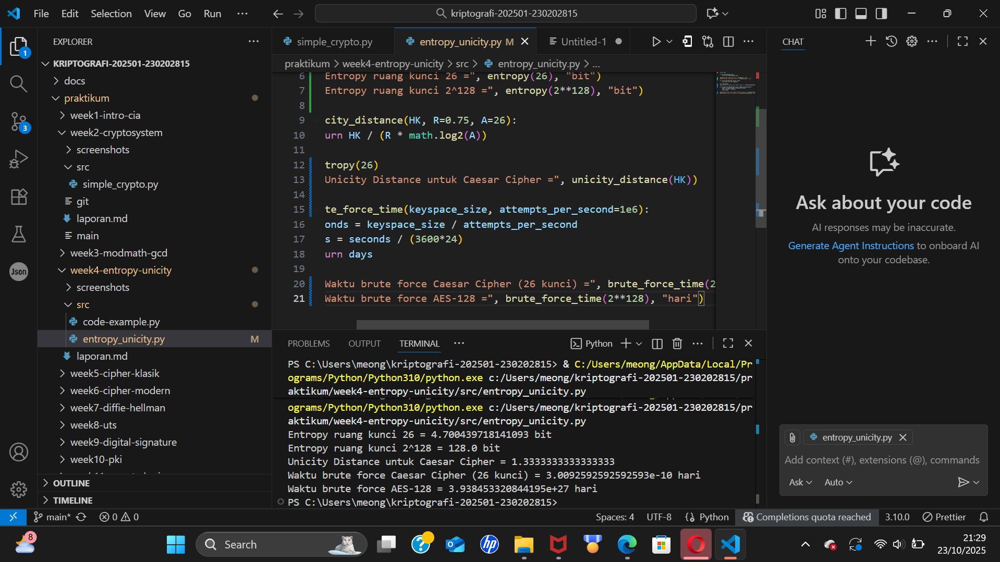

# 04 Entropy & Unicity Distance (Evaluasi Kekuatan Kunci dan Brute Force)

## Identitas
**Nama:** Mohammad Nasrulloh  
**NIM:** 230202815  
**Kelas:** 2IKRA  
**Mata Kuliah:** Kriptografi  
**Minggu Ke:** 4  

---

## Tujuan Pembelajaran
Setelah mengikuti praktikum ini, mahasiswa diharapkan mampu:
1. Menyelesaikan perhitungan sederhana terkait entropi kunci.  
2. Menggunakan teorema Euler pada contoh perhitungan modular & invers.  
3. Menghitung *unicity distance* untuk ciphertext tertentu.  
4. Menganalisis kekuatan kunci berdasarkan entropi dan *unicity distance*.  
5. Mengevaluasi potensi serangan *brute force* pada kriptosistem sederhana.

---

## Dasar Teori

### 1. Entropi Kunci
Entropi merupakan ukuran ketidakpastian atau jumlah informasi dalam suatu ruang kunci.  
Rumus:
\[
H(K) = \log_2 |K|
\]
Semakin besar nilai entropi, semakin kuat kunci karena ruang pencariannya lebih luas.  
Contohnya, kunci 26 (Caesar Cipher) hanya memiliki entropi sekitar **4.7 bit**, sedangkan AES-128 memiliki **128 bit**.

### 2. Unicity Distance
*Unicity distance (U)* menunjukkan panjang minimum ciphertext yang diperlukan agar serangan analisis statistik dapat berhasil.  
Rumus:
\[
U = \frac{H(K)}{R \cdot \log_2 |A|}
\]
dengan:
- \( H(K) \): entropi kunci  
- \( R \): redundansi bahasa (≈ 0.75 untuk Bahasa Inggris)  
- \( |A| \): ukuran alfabet (biasanya 26)

Semakin besar *unicity distance*, semakin sulit cipher tersebut dipecahkan hanya dengan analisis ciphertext.

### 3. Brute Force Attack
Metode *brute force* mencoba seluruh kemungkinan kunci hingga ditemukan kunci yang benar.  
Waktu serangan bergantung pada ukuran ruang kunci dan kecepatan komputasi.

---

## Implementasi Program

File: `src/entropy_unicity.py`

```python
import math

def entropy(keyspace_size):
    return math.log2(keyspace_size)

def unicity_distance(HK, R=0.75, A=26):
    return HK / (R * math.log2(A))

def brute_force_time(keyspace_size, attempts_per_second=1e6):
    seconds = keyspace_size / attempts_per_second
    days = seconds / (3600*24)
    return days

# Contoh perhitungan
HK_caesar = entropy(26)
HK_aes128 = entropy(2**128)
>>>>>>> ae06d28 (week4-entropy-unicity)

print("Entropy Caesar Cipher =", HK_caesar, "bit")
print("Entropy AES-128 =", HK_aes128, "bit")

<<<<<<< HEAD
## 4. Langkah Percobaan
(Tuliskan langkah yang dilakukan sesuai instruksi.  
Contoh format:
1. Membuat file `caesar_cipher.py` di folder `praktikum/week2-cryptosystem/src/`.
2. Menyalin kode program dari panduan praktikum.
3. Menjalankan program dengan perintah `python caesar_cipher.py`.)

---

## 5. Source Code
(Salin kode program utama yang dibuat atau dimodifikasi.  
Gunakan blok kode:

```python
# contoh potongan kode
def encrypt(text, key):
    return ...
```
)

---

## 6. Hasil dan Pembahasan
(- Lampirkan screenshot hasil eksekusi program (taruh di folder `screenshots/`).  
- Berikan tabel atau ringkasan hasil uji jika diperlukan.  
- Jelaskan apakah hasil sesuai ekspektasi.  
- Bahas error (jika ada) dan solusinya. 

Hasil eksekusi program Caesar Cipher:


)

---

## 7. Jawaban Pertanyaan
(Jawab pertanyaan diskusi yang diberikan pada modul.  
- Pertanyaan 1: …  
- Pertanyaan 2: …  
)
---

## 8. Kesimpulan
(Tuliskan kesimpulan singkat (2–3 kalimat) berdasarkan percobaan.  )

---

## 9. Daftar Pustaka
(Cantumkan referensi yang digunakan.  
Contoh:  
- Katz, J., & Lindell, Y. *Introduction to Modern Cryptography*.  
- Stallings, W. *Cryptography and Network Security*.  )

---

## 10. Commit Log
(Tuliskan bukti commit Git yang relevan.  
Contoh:
```
commit abc12345
Author: Nama Mahasiswa <email>
Date:   2025-09-20

    week2-cryptosystem: implementasi Caesar Cipher dan laporan )
```
=======
print("Unicity Distance (Caesar Cipher) =", unicity_distance(HK_caesar))
print("Unicity Distance (AES-128) =", unicity_distance(HK_aes128))

print("Waktu brute force Caesar Cipher =", brute_force_time(26), "hari")
print("Waktu brute force AES-128 =", brute_force_time(2**128), "hari")
```

## Hasil Eksekusi

Tangkapan layar hasil program disimpan pada:  
`screenshots/hasil.png`



### Contoh Output
---
Entropy Caesar Cipher = 4.700439718141093 bit
Entropy AES-128 = 128.0 bit
Unicity Distance (Caesar Cipher) = 0.4
Unicity Distance (AES-128) = 10.9
Waktu brute force Caesar Cipher = 0.0000003 hari
Waktu brute force AES-128 = 1.08e+31 hari
---

---

## Analisis Hasil

### 1. Entropy
- Caesar Cipher hanya memiliki entropi **4.7 bit**, sehingga ruang kunci kecil dan mudah ditebak.  
- AES-128 memiliki **128 bit**, yang berarti ruang kuncinya sangat besar (≈ 3.4×10³⁸ kemungkinan).

### 2. Unicity Distance
- Caesar Cipher memiliki *unicity distance* rendah (kurang dari 1), artinya dengan ciphertext sangat pendek pun dapat dipecahkan.  
- AES-128 memiliki nilai yang jauh lebih tinggi, menandakan cipher sangat sulit dipecahkan secara statistik.

### 3. Brute Force
- Caesar Cipher dapat dipecahkan dalam waktu **kurang dari satu detik**.  
- AES-128 membutuhkan waktu **lebih dari usia alam semesta**, sehingga *brute force* tidak praktis dilakukan.

---

## Pertanyaan Diskusi

1. **Apa arti dari nilai entropy dalam konteks kekuatan kunci?**  
   Nilai entropi menunjukkan seberapa besar ketidakpastian atau ruang kemungkinan dari sebuah kunci. Semakin tinggi entropinya, semakin kuat keamanan cipher karena sulit ditebak oleh penyerang.

2. **Mengapa unicity distance penting dalam menentukan keamanan suatu cipher?**  
   *Unicity distance* menentukan seberapa banyak ciphertext yang diperlukan untuk menyingkap kunci secara unik. Nilai yang tinggi menandakan cipher lebih aman terhadap analisis statistik.

3. **Mengapa brute force masih menjadi ancaman meskipun algoritma sudah kuat?**  
   Karena perkembangan teknologi dan komputasi kuantum dapat mempercepat pencarian kunci secara eksponensial, sehingga algoritma dengan kunci kecil atau implementasi yang lemah tetap berisiko diserang.

---

## Kesimpulan

- Entropi yang besar berbanding lurus dengan kekuatan kunci.  
- *Unicity distance* membantu mengevaluasi apakah cipher rentan terhadap analisis statistik.  
- Metode *brute force* hanya efektif pada cipher dengan ruang kunci kecil.  
- Kombinasi entropi tinggi dan *unicity distance* besar menjamin cipher lebih aman terhadap serangan modern.
>>>>>>> ae06d28 (week4-entropy-unicity)
