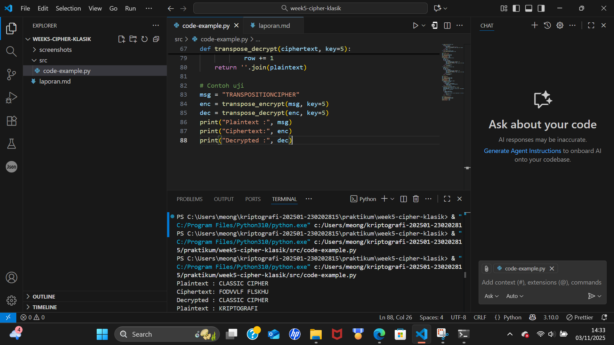

# Laporan Praktikum Week 5 — Cipher Klasik

## Identitas
**Nama:** Mohammad Nasrulloh  
**NIM:** 230202815  
**Kelas:** 2IKRB  
**Mata Kuliah:** Kriptografi  
**Topik:** Cipher Klasik (Caesar, Vigenère, Transposisi)

---

## Tujuan Pembelajaran
Setelah mengikuti praktikum ini, mahasiswa diharapkan mampu:  
1. Menerapkan algoritma **Caesar Cipher** untuk enkripsi dan dekripsi teks.  
2. Menerapkan algoritma **Vigenère Cipher** dengan variasi kunci.  
3. Mengimplementasikan algoritma transposisi sederhana.  
4. Menjelaskan kelemahan algoritma kriptografi klasik.  

## 1. Teori Singkat
Cipher klasik merupakan metode enkripsi sederhana yang digunakan sebelum era komputer modern.  
Beberapa algoritma utama:
- **Caesar Cipher** → setiap huruf digeser sejauh nilai kunci tertentu.
- **Vigenère Cipher** → menggunakan kata kunci untuk menentukan pergeseran tiap huruf.
- **Transposisi Cipher** → bukan mengganti huruf, melainkan mengacak urutannya.

---

## 2. Hasil Uji Implementasi

### Caesar Cipher
| Plaintext | Key | Ciphertext | Decrypted |
|------------|-----|-------------|------------|
| CLASSIC CIPHER | 3 | FODVVLF FLSKHU | CLASSIC CIPHER |

### Vigenère Cipher
| Plaintext | Key | Ciphertext | Decrypted |
|------------|-----|-------------|------------|
| KRIPTOGRAFI | KEY | URMVXYSLCJQ | KRIPTOGRAFI |

### Transposisi Cipher
| Plaintext | Key | Ciphertext | Decrypted |
|------------|-----|-------------|------------|
| TRANSPOSITIONCIPHER | 5 | TPOISNHARTOSITCENPR | TRANSPOSITIONCIPHER |

---

## 3. Screenshot Hasil Program

Berikut tampilan hasil eksekusi program di terminal:

---

## 4. Jawaban Pertanyaan Diskusi

1. **Kelemahan Caesar & Vigenère Cipher**  
   - Caesar Cipher hanya memiliki 25 kemungkinan kunci → mudah dibobol brute force.  
   - Vigenère Cipher tampak lebih kuat, tetapi masih bisa diserang dengan analisis frekuensi atau metode Kasiski jika panjang kunci diketahui.  

2. **Cipher klasik mudah diserang analisis frekuensi karena**  
   Pola huruf dalam bahasa alami (misalnya huruf ‘E’ paling sering muncul dalam bahasa Inggris) tetap terlihat pada ciphertext jika metode enkripsi hanya mengganti huruf tanpa mengacak struktur kalimat.  

3. **Substitusi vs Transposisi**
   | Aspek | Substitusi (Caesar/Vigenère) | Transposisi |
   |--------|-------------------------------|--------------|
   | Metode | Mengganti huruf | Menukar posisi huruf |
   | Pola frekuensi | Tetap sama | Agak tersembunyi |
   | Kelemahan | Mudah dianalisis pola huruf | Mudah dianalisis struktur |
   | Contoh | Caesar, Vigenère | Rail Fence, Columnar Transposition |

---

## 5. Kesimpulan
Algoritma kriptografi klasik efektif untuk pembelajaran dasar tetapi **tidak aman** untuk penggunaan modern karena mudah dianalisis.  
Teknologi modern seperti **AES**, **RSA**, dan **ECC** kini digunakan untuk keamanan digital nyata.

---

## 6. Informasi Repository
Commit message yang digunakan:
- week5-cipher-klasik
