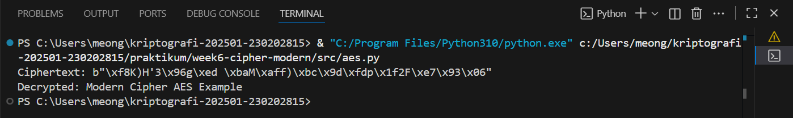
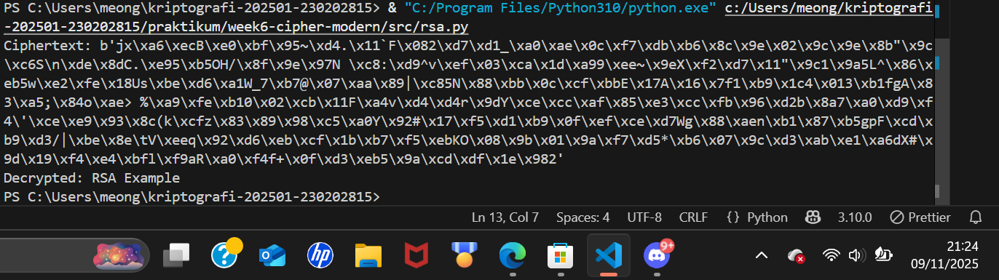

# Laporan Praktikum Kriptografi
Minggu ke-: 6
Topik: Cipher Modern (DES, AES, RSA)  
Nama: Mohammad Nasrulloh  
NIM: 230202815
Kelas: 5IKRA

---

# Praktikum 06: Cipher Modern (DES, AES, RSA)

## Tujuan Pembelajaran
Setelah mengikuti praktikum ini, mahasiswa diharapkan mampu:

1. Mengimplementasikan algoritma **DES** untuk blok data sederhana.
2. Menerapkan algoritma **AES** dengan panjang kunci 128 bit.
3. Menjelaskan proses pembangkitan kunci publik dan privat pada algoritma **RSA**.

---

## Ringkasan Teori Algoritma Modern

### 1. DES (Data Encryption Standard)
- **Jenis:** Symmetric-key block cipher
- **Panjang blok:** 64 bit
- **Panjang kunci:** 56 bit efektif (8 byte)
- **Mode operasi umum:** ECB, CBC
- **Kelemahan:** Rentan terhadap serangan brute force karena panjang kunci pendek.  

### 2. AES (Advanced Encryption Standard)
- **Jenis:** Symmetric-key block cipher
- **Panjang blok:** 128 bit
- **Panjang kunci:** 128, 192, atau 256 bit
- **Mode operasi umum:** ECB, CBC, CFB, OFB, CTR, GCM, EAX
- **Kelebihan:** Lebih aman dari DES, efisien, digunakan secara luas di era modern.

### 3. RSA (Rivest-Shamir-Adleman)
- **Jenis:** Asymmetric-key (public-key) cryptography
- **Panjang kunci umum:** 1024–4096 bit
- **Proses utama:**
  - Generate key pair (public & private)
  - Enkripsi dengan **public key**
  - Dekripsi dengan **private key**
- **Kelebihan:** Digunakan untuk pertukaran kunci aman, digital signature, dan enkripsi data sensitif.

---

## Implementasi Praktikum

### DES (Opsional)
```python
from Crypto.Cipher import DES
from Crypto.Random import get_random_bytes

key = get_random_bytes(8)  # 64-bit key
cipher = DES.new(key, DES.MODE_ECB)

plaintext = b"ABCDEFGH"
ciphertext = cipher.encrypt(plaintext)
print("Ciphertext:", ciphertext)

decipher = DES.new(key, DES.MODE_ECB)
decrypted = decipher.decrypt(ciphertext)
print("Decrypted:", decrypted)
```
### DES

### AES
```
from Crypto.Cipher import AES
from Crypto.Random import get_random_bytes

key = get_random_bytes(16)  # 128-bit key
cipher = AES.new(key, AES.MODE_EAX)

plaintext = b"Modern Cipher AES Example"
ciphertext, tag = cipher.encrypt_and_digest(plaintext)
print("Ciphertext:", ciphertext)

# Dekripsi
cipher_dec = AES.new(key, AES.MODE_EAX, nonce=cipher.nonce)
decrypted = cipher_dec.decrypt(ciphertext)
print("Decrypted:", decrypted.decode())
```

### RSA
```
from Crypto.PublicKey import RSA
from Crypto.Cipher import PKCS1_OAEP

key = RSA.generate(2048)
private_key = key
public_key = key.publickey()

# Enkripsi
cipher_rsa = PKCS1_OAEP.new(public_key)
plaintext = b"RSA Example"
ciphertext = cipher_rsa.encrypt(plaintext)
print("Ciphertext:", ciphertext)

# Dekripsi
decipher_rsa = PKCS1_OAEP.new(private_key)
decrypted = decipher_rsa.decrypt(ciphertext)
print("Decrypted:", decrypted.decode())
```

## Pertanyaan Diskusi

### 1. Perbedaan mendasar DES, AES, dan RSA
- **DES & AES:** Symmetric-key (satu kunci untuk enkripsi & dekripsi)  
- **RSA:** Asymmetric-key (public & private key berbeda)  
- **Keamanan:**  
  - AES lebih aman daripada DES karena kunci lebih panjang  
  - RSA menggunakan teori bilangan prima besar sehingga aman untuk pertukaran kunci

### 2. Mengapa AES lebih banyak digunakan dibanding DES
- DES terlalu pendek (56-bit) → rentan terhadap serangan brute force  
- AES lebih efisien dan aman untuk enkripsi data modern  
- Mendukung berbagai panjang kunci dan mode operasi

### 3. Mengapa RSA dikategorikan sebagai algoritma asimetris & proses pembangkitan kuncinya
- RSA memiliki **dua kunci berbeda**: public key untuk enkripsi, private key untuk dekripsi  
- **Proses pembangkitan kunci:**  
  1. Pilih dua bilangan prima besar `p` dan `q`  
  2. Hitung `n = p * q`  
  3. Hitung totien `φ(n) = (p-1)(q-1)`  
  4. Pilih `e` (public exponent), hitung `d` (private exponent) sehingga `e*d ≡ 1 mod φ(n)`  
  5. Public key = `(e, n)`, Private key = `(d, n)`

---

## Kesimpulan
- **AES-128:** Aman, cepat, dan praktis untuk enkripsi blok data  
- **DES:** Bersifat edukatif/legacy, tidak direkomendasikan untuk data sensitif  
- **RSA:** Digunakan untuk pertukaran kunci dan digital signature dengan prinsip asimetris
