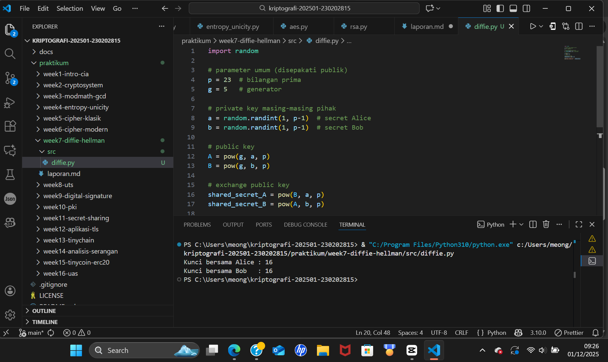

# Laporan Praktikum – Week 7  
## Diffie-Hellman Key Exchange

### Nama  : Mohammad Nasrulloh  
### NIM   : 230202815  
### Kelas : 2IKRB

---

# 1. Tujuan Praktikum
Praktikum ini bertujuan untuk:
1. Melakukan simulasi protokol **Diffie-Hellman** dalam pertukaran kunci.
2. Memahami bagaimana dua pihak dapat membuat kunci rahasia yang sama melalui saluran publik.
3. Menganalisis potensi serangan **Man-in-the-Middle (MITM)** pada protokol Diffie-Hellman.

---

# 2. Dasar Teori Singkat

## 2.1 Prinsip Kerja Diffie-Hellman
Diffie-Hellman memungkinkan dua pihak (Alice dan Bob) menghasilkan **kunci rahasia bersama** meskipun hanya bertukar informasi melalui jaringan publik.

Prosesnya:
1. Alice dan Bob menyepakati bilangan **prima p** dan **generator g** (publik).
2. Masing-masing memilih **private key**:
   - Alice: `a`
   - Bob: `b`
3. Masing-masing menghitung **public key**:
   - `A = g^a mod p`
   - `B = g^b mod p`
4. Mereka saling bertukar public key.
5. Keduanya menghitung **shared secret**:
   - Alice: `K = B^a mod p`
   - Bob: `K = A^b mod p`

Nilai keduanya akan sama karena sifat aritmetika modular:

(g^b)^a mod p == (g^a)^b mod p


---

# 3. Implementasi Program

Kode program (disimpan di `src/diffie.py`):

```python
import random

# parameter umum (publik)
p = 23
g = 5

# private key
a = random.randint(1, p-1)
b = random.randint(1, p-1)

# public key
A = pow(g, a, p)
B = pow(g, b, p)

# shared secret
shared_secret_A = pow(B, a, p)
shared_secret_B = pow(A, b, p)

print("Kunci bersama Alice :", shared_secret_A)
print("Kunci bersama Bob   :", shared_secret_B)
```
# 4. Hasil Eksekusi Program

Berikut hasil eksekusi program (disimpan pada screenshots/hasil.png):



## 5. Simulasi Serangan MITM (Man-in-the-Middle)

Pada serangan MITM:

- Eve mencegat **public key A** dan **B**.
- Eve menggantinya masing-masing dengan **public key palsu E1** dan **E2**.

Akibatnya:
- Alice menghasilkan kunci rahasia dengan Eve → `K_AE`
- Bob menghasilkan kunci rahasia dengan Eve → `K_BE`
- Alice dan Bob tidak memiliki kunci yang sama, tetapi Eve memiliki keduanya.

**Contoh alur komunikasi:**

Alice --> A* (palsu dari Eve) --> Bob z
Bob --> B* (palsu dari Eve) --> Alice

**Perhitungan Eve:**
- `K_AE = (public_Alice)^e mod p`
- `K_BE = (public_Bob)^e mod p`

Sehingga Eve dapat membaca semua pesan terenkripsi.

**Kesimpulan:** Diffie-Hellman murni rentan MITM jika tidak memakai autentikasi.

---

## 6. Jawaban Pertanyaan Diskusi

1. **Mengapa Diffie-Hellman memungkinkan pertukaran kunci di saluran publik?**  
   Karena pihak yang bertukar hanya mengirim *public key*, dan kunci rahasia dihitung melalui operasi logaritma diskrit, yang sangat sulit dibalik tanpa mengetahui *private key*. Dengan demikian, meskipun saluran publik, penyadap tidak bisa menghitung kunci rahasia.

2. **Apa kelemahan utama Diffie-Hellman murni?**  
   Kelemahan utamanya adalah tidak adanya autentikasi. Siapa saja dapat:
   - Menyamar sebagai salah satu pihak  
   - Mencegat dan mengganti *public key*  
   - Melakukan serangan *Man-in-the-Middle*

3. **Bagaimana mencegah serangan MITM?**  
   Menggunakan mekanisme autentikasi, seperti:
   - Digital signature  
   - Certificate Authority (CA) / SSL  
   - Public Key Infrastructure (PKI)  
   - Authenticated Diffie-Hellman (misal: ECDHE + sertifikat)  

   Dengan autentikasi, attacker tidak dapat menyusup dan mengganti *public key*.

---

## 7. Kesimpulan

Pada praktikum ini:
- Protokol Diffie-Hellman berhasil menghasilkan kunci yang sama antara dua pihak.  
- MITM dapat terjadi jika tidak ada autentikasi.  
- Untuk keamanan nyata, Diffie-Hellman harus digabungkan dengan mekanisme verifikasi identitas.  

---

## 8. Bukti Pengumpulan Git

commit week7-diffie-hellman
Author: Mohammad Nasrulloh <srullasrul59@gmail.com>
Date:   2025-12-01

    week7-diffie-hellman: implementasi dan laporan

